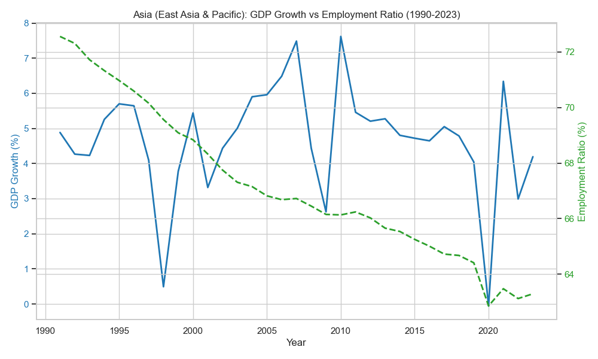
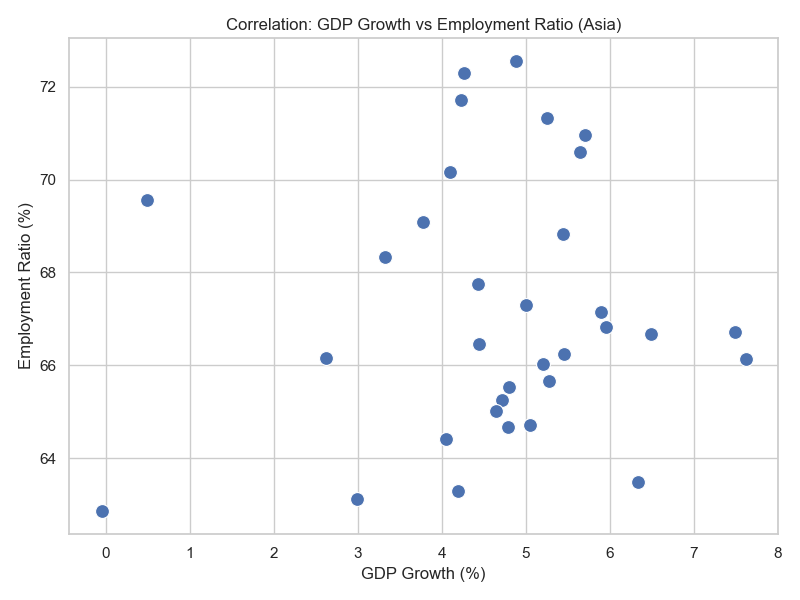
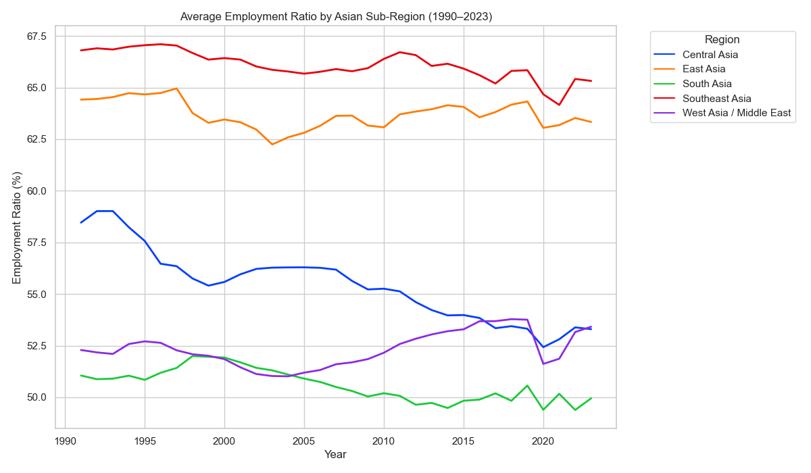

## Asia Region Analysis

The first graph explains the how GDP and employment ratio changed from 1990 to 2023. From the graph, we can see GDP growth experiencing huge dips in 1997, 2008, and 2020, which corresponds to some major historical events like 1997 Asian Financial Crisis, 2008 Global Financial Crisis, and COVID-19 pandemic. All of these dips, are followed by rebounds, indicating the speed recovery of the Asia economic system. 
On the other hand, the employment ratio shows a relatively stable downward trend, decreasing over time from 73% to about 63% with only one noticeable dip in 2020, during the COVID-19 pandemic. 

When we look closely into the relationship between GDP growth and employment ratio in Asia, we found that the scatter plot only conveys a very weak relationship between these two factors. The points on the graph are relatively dispersed, and we are unable to say that GDP growth would affect the labor force participation rate in Asia.

In the GDP Growth analysis for subregions in Asia, we see that West Asia experience that sharpest rise in 1993, then the GDP growth fluctuates and gradually decrease over time. For East Asia, it follows the pattern of majority of the subregions, but started to take the lead in 2010, experienced the largest dip during the COVID-19 pandemic, and then rebounds rapidly afterwards. Central Asia, however, had two largest drop in GDP growth in 1991 and 1993, with a rebound and gradual growth after 1998. South Asia and Southeast Asia followed the trend of GDP growth, but it is worth notice that their GDP growth started to decrease after 2021. 

When we investigate the employment ratio in specific subregions of Asia, we see some similar patterns in Southeast Asia (66%) and East Asia (64%). The employment ratio in these two regions is relatively stable over time, with some small fluctuations within in 2%. Central Asia shows a similar trend to what we have seen in Asia’s overall employment ratio, showing a decreasing employment ratio, from about 59% to 53% over time. West Asia, with an employment ratio of 52.5% in 1990, experienced fluctuations but slowly increasing to about 54% in 2018, then decreases to 51% and quickly rebounds. Lastly, for South Asia, overall, it shows a slowly decreasing employment ratio (from 51.5% to 50%), with some fluctuations. Interestingly, we can see that the employment ratio all dropped during the COVID-19 pandemic.

From these graphs, we are able to see that the GDP growth is affected by major historical shocks to the economy, usually followed by a fast rebound. While for employment ratio, the labor market structures are not affected by these major shocks and the short-run economic performance. Combine them together, our subregion analysis also corresponds to what we have found in the correlation scatter plot, GDP growth and employment ratio have different drivers that affect them, and these two factors alone, does not convey a strong relationship between each other.  
