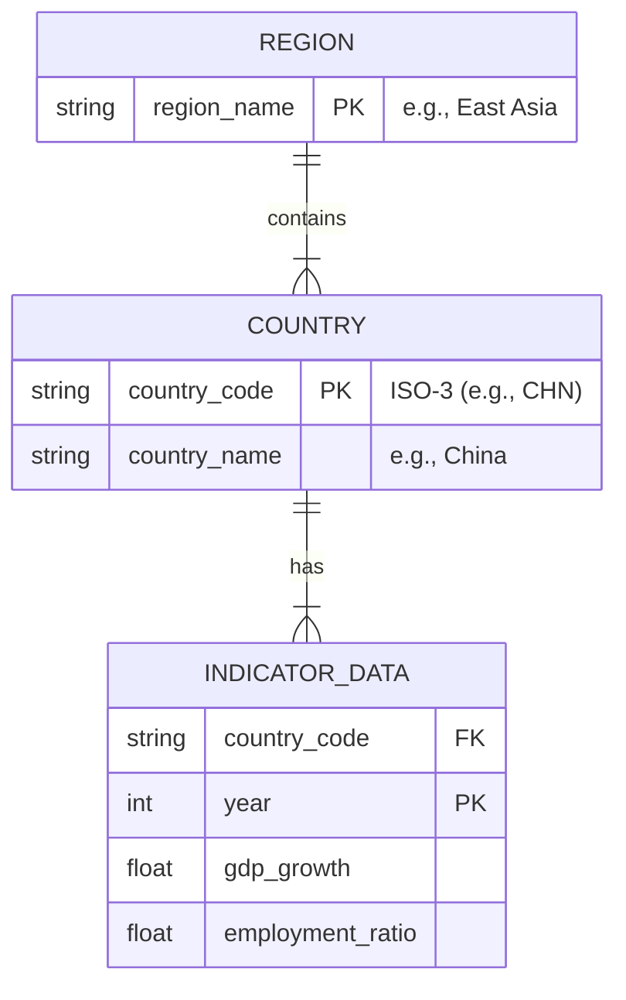

# Codebook: Asia Region Analysis

## Data Source
All data was retrieved from the World Bank World Development Indicators (WDI) API using the `wbgapi` Python library.

## Region Classifications
Countries were aggregated into the following sub-regions for analysis:

**East Asia**: China, Japan, Mongolia, South Korea, North Korea, Macao.
**Southeast Asia**: Indonesia, Thailand, Vietnam, Malaysia, Singapore, Philippines, Cambodia, Laos, Myanmar, Brunei, Timor-Leste.
**South Asia**: India, Pakistan, Bangladesh, Sri Lanka, Nepal, Bhutan, Maldives, Afghanistan.
**Central Asia**: Kazakhstan, Uzbekistan, Kyrgyzstan, Tajikistan, Turkmenistan.
**West Asia / Middle East**: Saudi Arabia, United Arab Emirates, Qatar, Bahrain, Oman, Kuwait, Turkey, Israel, Jordan, Lebanon, Iraq, Iran, Yemen, Syria.

## Entity-Relationship Diagram

