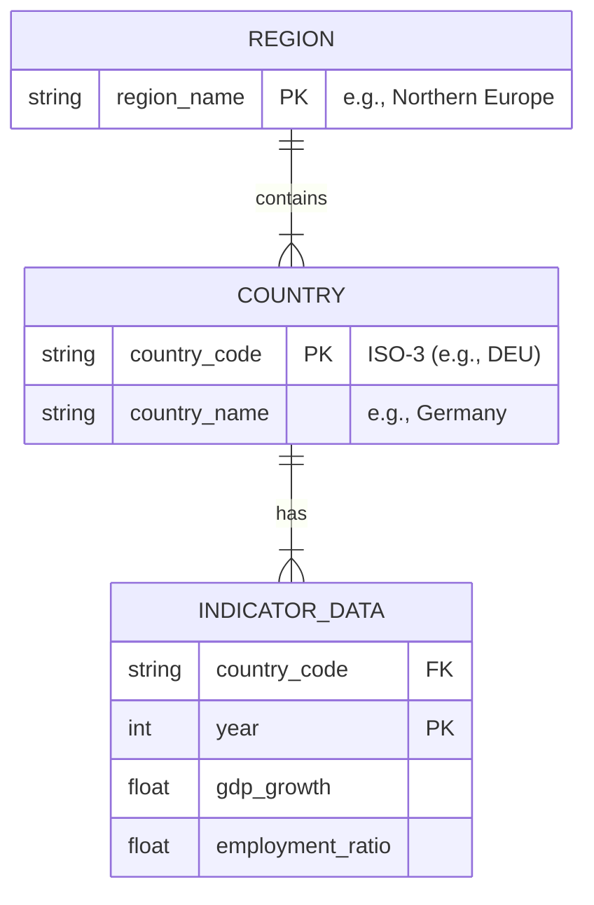

# Codebook: Europe Region Analysis

## Data Source
All data was retrieved from the World Bank World Development Indicators (WDI) API using the `wbgapi` Python library.

## Variables

| Variable Name | Original WDI Code | Definition | Unit | Data Type |
| :--- | :--- | :--- | :--- | :--- |
| **Year** | N/A | The calendar year of observation (1990-2023). | Years | Integer |
| **GDP Growth** | `NY.GDP.MKTP.KD.ZG` | Annual percentage growth rate of GDP at market prices based on constant local currency. Aggregates are based on constant 2015 U.S. dollars. | % | Float |
| **Employment Ratio** | `SL.EMP.TOTL.SP.ZS` | Employment to population ratio is the proportion of a country's population that is employed. Age 15+, Total. | % | Float |
| **Country** | `economy` | The specific country name (e.g., "Germany", "France"). Derived from ISO-3 country codes. | N/A | String |
| **Region** | Derived | Sub-regions defined for analysis to group countries geographically. | N/A | String |

## Region Classifications
Countries were aggregated into the following sub-regions for analysis:

* **Northern Europe:** Denmark, Finland, Iceland, Norway, Sweden, Estonia, Latvia, Lithuania.
* **Southern Europe:** Italy, Greece, Portugal, Croatia, Malta, Cyprus.
* **Eastern Europe:** Russia, Ukraine, Bulgaria, Romania, Moldova, Belarus.
* **Western Europe:** France, Spain, Belgium, Netherlands, Switzerland, Luxembourg.
* **Central Europe:** Germany, Poland, Austria, Hungary, Czechia, Slovakia, Slovenia.
* **British Isles:** United Kingdom, Ireland.

## Entity-Relationship Diagram

