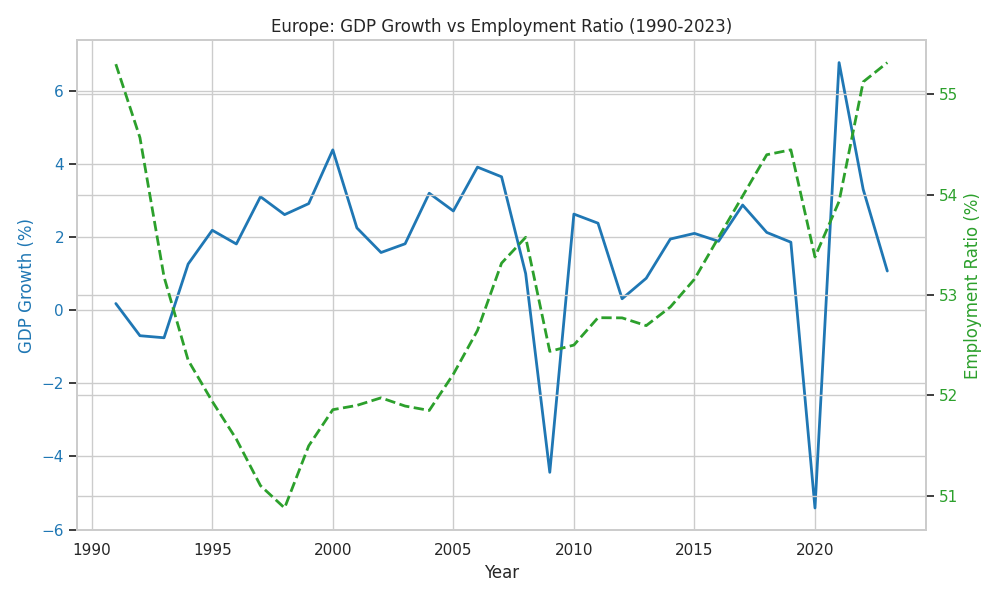
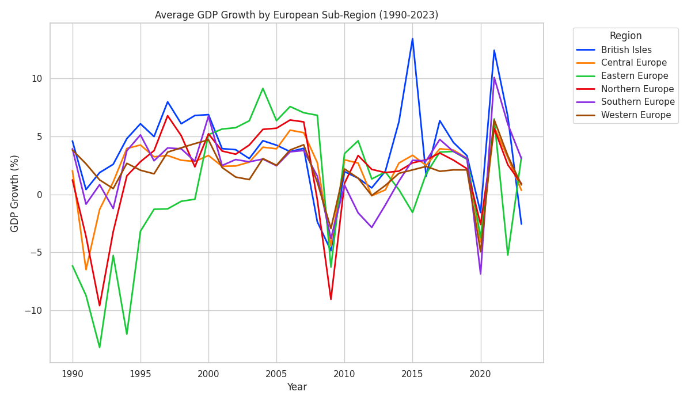
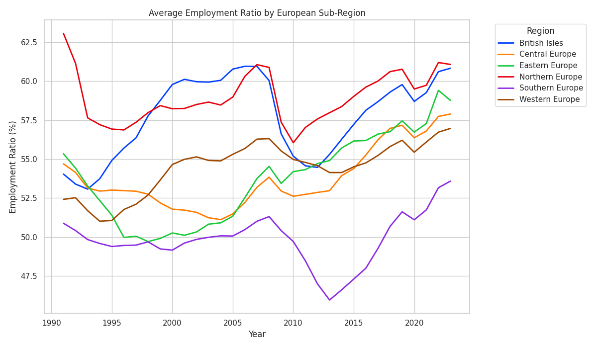

## Europe Region Analysis

Across Europe from 1990 to 2023, economic growth and labor market participation have followed surprisingly divergent paths. While the region averaged 1.74% annual GDP growth, this figure masked significant volatility, particularly during the 2009 financial crisis and the COVID-19 pandemic. In contrast, the employment-to-population ratio remained relatively stable at an average of 52.94%, showing little reaction to these sharp economic shocks.

The resulting correlation coefficient of -0.136 confirms that for the continent as a whole, annual fluctuations in economic output do not drive immediate shifts in employment levels. As seen in the scatter plot below, there is no linear pattern linking high-growth years to higher employment, suggesting that the European labor market is insulated from short-term business cycles but potentially more responsive to long-term structural changes.

Beneath these aggregate numbers, however, distinct regional narratives emerge. Eastern Europe stands out for its economic volatility, having navigated severe post-Soviet contractions followed by rapid catch-up growth, whereas Western and Southern Europe maintained more modest, steady expansion.

A persistent "North-South gap" also defines the continent’s labor dynamics: Northern Europe and the British Isles consistently sustain high employment ratios (55-63%), likely due to robust labor institutions, while Southern Europe lags significantly behind (45-53%). Interestingly, Eastern Europe has charted a remarkable path of convergence, steadily recovering from its 1990s lows to match Western European employment levels by 2020.

Ultimately, the persistence of these regional disparities, even amidst shared economic conditions, suggests that geography, regulatory frameworks, and legacy economic systems play a far more critical role in determining European labor market participation than annual GDP growth alone.
