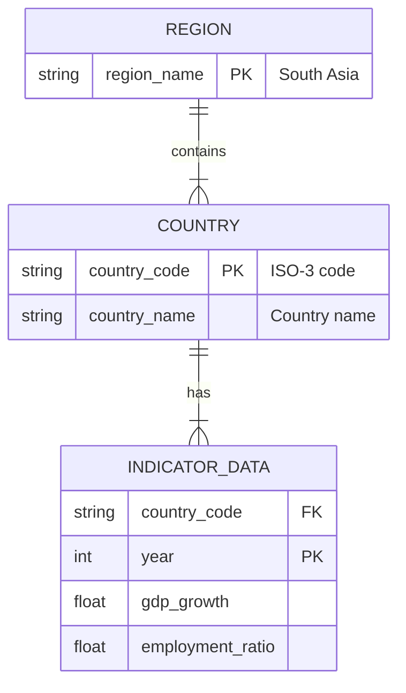

```markdown
# Codebook — South Asia Region Analysis

---

## Data Source

All data were retrieved from the World Bank **World Development Indicators (WDI)** API using the `wbgapi` Python library.

---

## Variables

| Variable Name | Original WDI Code | Definition | Unit | Data Type |
|----------------|-------------------|-------------|------|-------------|
| **Year** | N/A | Calendar year of observation (1990–2023). | Year | Integer |
| **GDP Growth** | `NY.GDP.MKTP.KD.ZG` | Annual percentage growth rate of GDP at market prices based on constant local currency. Aggregates are based on constant 2015 U.S. dollars. | Percent (%) | Float |
| **Employment Ratio** | `SL.EMP.TOTL.SP.ZS` | Employment-to-population ratio representing the proportion of the population aged 15+ that is employed. | Percent (%) | Float |
| **Country** | `economy` | Country name derived from ISO-3 economy codes (e.g., “India”, “Bangladesh”). | N/A | String |
| **Region** | Derived | Geographic classification grouping all observations under the **South Asia** region. | N/A | String |

---

## Region Classification

The **South Asia** regional group includes the following countries:

- Afghanistan  
- Bangladesh  
- Bhutan  
- India  
- Maldives  
- Nepal  
- Pakistan  
- Sri Lanka  

---

## Data Cleaning & Preparation

Raw WDI country-year observations were processed using **SQL within SQLite** prior to analysis. Data preparation steps included:

- Excluding records with missing GDP growth or employment-to-population ratio values.
- Converting year values from string format (e.g., `"YR1998"`) into numeric integers.
- Creating a cleaned master table (`south_asia_clean`) used for all downstream analyses.

Descriptive statistics—including country-level and year-level averages—were computed in SQL using grouped aggregation (`GROUP BY`) before performing modeling and visualization in Python.

---

## Entity–Relationship Diagram


## Analytical Use

SQL was used for data cleaning, filtering, transformation, and computation of descriptive statistics.

Python was used for modeling, correlation testing, and visualization, including:

Time series trend plots,

Scatter correlation analysis, and

Dual-axis comparison charts examining the relationship between GDP growth and employment participation across South Asia over time.
